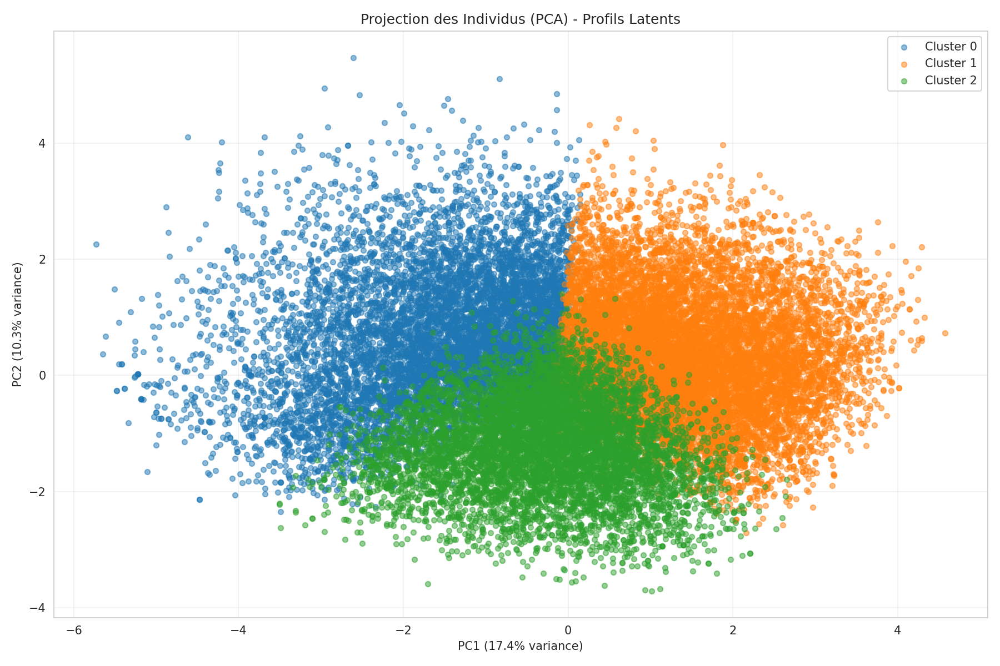
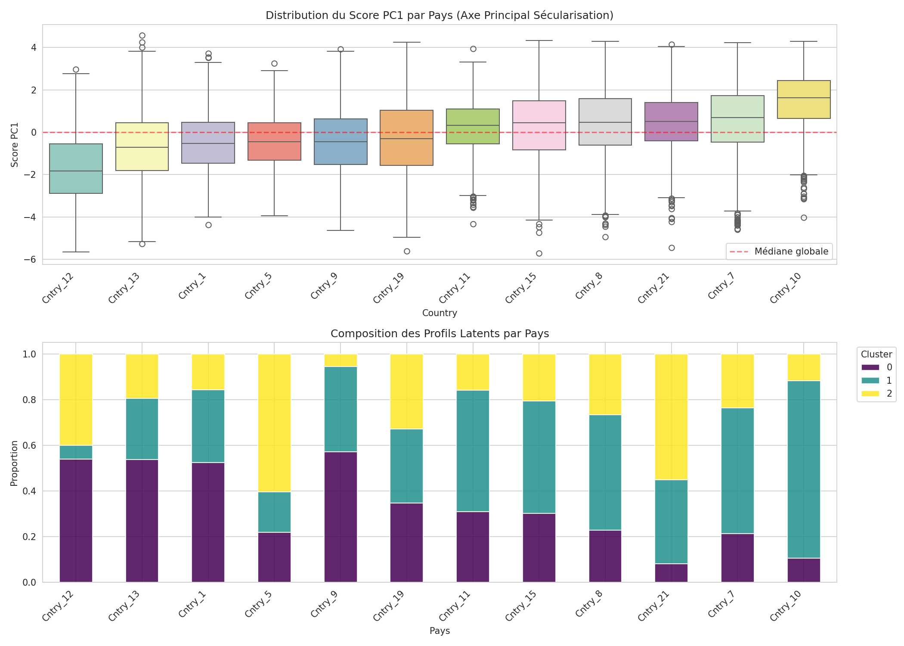
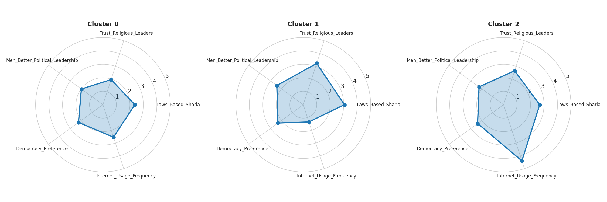

<div align="center">
  <h1>🌍 MENA Secularization Analysis</h1>
  <h3>Data Mining • Unsupervised Learning • Sociological Profiling</h3>

  <p>
    Une approche quantitative pour décoder les dynamiques de sécularisation dans le monde arabe 
    via l'analyse de données massives (Arab Barometer), utilisant <strong>PCA, K-Means Clustering et Tests Statistiques</strong>.
  </p>

  
  
  
  
  
</div>

# **Project Visualization**

> *Projection des 26,154 individus sur le plan factoriel (PCA). Les couleurs représentent les 3 profils sociétaux latents identifiés par l'algorithme.*

<br>

## 📝 Table of Contents
1. [Aperçu du Projet](#overview)
2. [Méthodologie & Pipeline](#methodology)
3. [Analyses & Résultats Clés](#findings)
4. [Profilage des Clusters](#clusters)
5. [Installation & Usage](#install)
6. [Contact](#contact)

<hr>

<a name="overview"></a>
## 🔭 Aperçu du Projet (Project Overview)

Ce projet vise à répondre à une problématique sociologique complexe par la data science : **"Dans quelle mesure les sociétés de la région MENA sont-elles prêtes à la sécularisation ?"**

Au lieu d'une approche théorique traditionnelle, nous utilisons le **Data Mining** sur un dataset de **+26,000 individus** répartis dans 12 pays pour identifier des structures latentes invisibles à l'œil nu.

**Objectifs Techniques :**
* **Réduction de dimensionnalité (PCA)** pour visualiser l'espace social et simplifier la complexité des variables.
* **Segmentation non-supervisée (K-Means)** pour découvrir des "archétypes sociétaux" naturels.
* **Validation statistique** des hypothèses via tests ANOVA et Chi-2.

<a name="methodology"></a>
## ⚙️ Méthodologie (Data Mining Pipeline)

Le projet suit un pipeline rigoureux d'analyse de données, de la donnée brute à l'interprétation :

| Phase | Technique | Description |
| :--- | :--- | :--- |
| **1. Préparation** | *Cleaning & Imputation* | Traitement des valeurs manquantes (imputation médiane), encodage et normalisation (StandardScaler). |
| **2. Réduction** | *PCA (ACP)* | Réduction de 16 variables socio-politiques en 2 axes majeurs expliquant 27.7% de la variance totale. |
| **3. Segmentation** | *K-Means Clustering* | Identification du nombre optimal de clusters ($k=3$) via la méthode du Coude (Elbow) et le Score de Silhouette. |
| **4. Interprétation** | *Radar Charts & Heatmaps* | Analyse des centroïdes pour nommer sociologiquement les clusters et tests d'hypothèses. |

<a name="findings"></a>
## 📊 Analyses & Résultats Clés

### 1. L'Espace Social (PCA)
L'analyse en composantes principales a révélé deux fractures majeures qui structurent la société MENA :
* **Axe X (PC1) - L'Axe Institutionnel :** Oppose la *Défiance/Sécularisme* (gauche) à la *Confiance/Allégeance Religieuse* (droite).
* **Axe Y (PC2) - L'Axe Socio-Économique :** Oppose les *Connectés Aisés* aux *Précaires Déconnectés*.

### 2. Géographie de la Sécularisation
La distribution des scores montre une forte hétérogénéité régionale.

*Certains pays montrent une prédominance claire du profil séculariste (violet), tandis que d'autres restent des bastions du traditionalisme (vert).*

<a name="clusters"></a>
## 🎭 Profilage des Clusters (Latent Profiles)

L'algorithme a identifié **3 profils distincts** (Archétypes) qui structurent la région.

<div align="center">
  
</div>

### 🟢 Cluster 0 : "Les Sécularistes Critiques" (31.8%)
* **Profil :** Groupe moteur du changement politique.
* **Marqueurs :** Rejet de l'instrumentalisation politique de la religion, faible confiance envers les leaders religieux et forte demande de réformes démocratiques.

### 🔵 Cluster 1 : "Les Traditionalistes Loyalistes" (40.4%)
* **Profil :** Gardiens du statu quo (groupe majoritaire).
* **Marqueurs :** Forte adhésion à la Charia comme loi d'État, confiance élevée dans les institutions religieuses. Faible usage d'Internet.

### 🟡 Cluster 2 : "Les Modernistes Connectés" (27.8%)
* **Profil :** Une classe émergente paradoxale ("The Digital Conservatives").
* **Marqueurs :** Hyper-connectés, revenus élevés, mais socialement conservateurs. Ce groupe prouve que **la modernisation économique n'entraîne pas mécaniquement la sécularisation politique**.

<a name="install"></a>
## 💻 Installation & Reproduction

### Prérequis
* Python 3.8+
* Jupyter Notebook

### Étapes
1.  **Cloner le repo**
    ```bash
    git clone [https://github.com/ChahiriAbderrahmane/MENA-Secularization-Analysis.git](https://github.com/ChahiriAbderrahmane/MENA-Secularization-Analysis.git)
    cd MENA-Secularization-Analysis
    ```

2.  **Installer les dépendances**
    ```bash
    pip install pandas numpy matplotlib seaborn scikit-learn scipy
    ```

3.  **Lancer l'analyse**
    Ouvrir le notebook principal pour régénérer les modèles et les graphiques.
    ```bash
    jupyter notebook notebooks/mining&visualisations.ipynb
    ```

<a name="contact"></a>
## 📨 Contact

**Équipe : Abderrahmane Chahiri, Hafsa Benabou**  
*Data Engineering & Data Mining Students*

**Liens :**  
- Abderrahmane Chahiri : [LinkedIn](https://www.linkedin.com/in/abderrahmane-chahiri-151b26237/) • [GitHub](https://github.com/ChahiriAbderrahmane)  
- Hafsa Benabou : [LinkedIn](#lien-linkedin-hafsa) • [GitHub](#lien-github-hafsa)  


<div align="center">
  Made with ❤️ & Python
</div>
